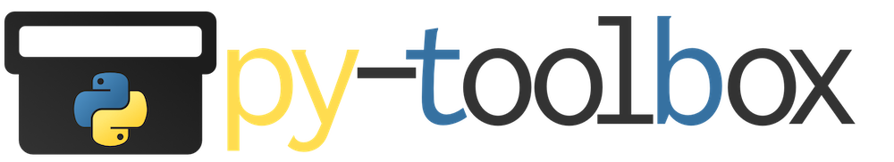

=====================
PyTb (Python Toolbox)
=====================

This is a collection of useful snippets I find myself to use
regularly during prototyping.

Most of the functions are especially useful when working on
remote machines via jupyter notebooks (e.g. a JupyterHub)
with long-running processes (e.g. Deeplearning).

Checkout the `Quickstart`_ section for common usecases and
example code.

`View the complete documentation <https://py-toolbox.readthedocs.io/en/latest/>`_

`View the code <https://github.com/dangrie158/py-toolbox>`_

----------
Quickstart
----------

- `Monitor long running tasks and get notified by email if something goes wrong or the job has finished <https://py-toolbox.readthedocs.io/en/latest/modules/notification.html#setup-monitoring-for-your-long-running-tasks>`_
- `Debug Remotely over a TCP connection <https://py-toolbox.readthedocs.io/en/latest/modules/rdb.html#remote-debugging>`_
- `Load Jupyter Notebooks as Python Modules <https://py-toolbox.readthedocs.io/en/latest/modules/importlib.html#importing-jupyter-notebooks-as-python-modules>`_
- `Reload modules when importing again (do not cache the result) <https://py-toolbox.readthedocs.io/en/latest/modules/importlib.html#automatically-reload-modules-and-packages-when-importing>`_
- `Mirroring all output of a script to a file <https://py-toolbox.readthedocs.io/en/latest/modules/io.html#redirecting-output-streams>`_
- `Automatically configure the framework <https://py-toolbox.readthedocs.io/en/latest/modules/core.html#autoconfigure-toolbox-frameworks>`_
- `Configure defaults <https://py-toolbox.readthedocs.io/en/latest/modules/config.html#configure-the-toolkit>`_

------------
Installation
------------

via pip:

    pip install py-toolbox

or via distutils::

    git clone https://github.com/dangrie158/py-toolbox.git pytb
    cd pytb
    python setup.py install

-----------
Development
-----------

Clone the repo and install the development requirements.
After this you can install the package in development mode
to just link the sources into your python path.

.. code:: bash

    git clone https://github.com/dangrie158/py-toolbox.git pytb
    cd pytb
    direnv allow
    # if you're not using direnv, you really should
    # otherwise create a new virtualenv for the package

    pip install -r dev-requirements.txt
    python3 setup.py develop

    make test
